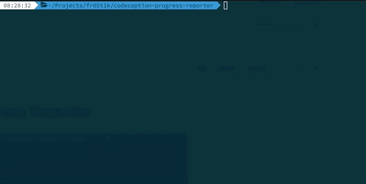

# Codeception Progress Reporter
[](https://travis-ci.org/fr05t1k/codeception-progress-reporter)



## How to install
```bash
composer require codeception/codeception-progress-reporter
```
## How to enable:
Place it in your `codeception.yml`
```yaml
extensions:
    enabled:
        - Codeception\ProgressReporter\ProgressReporter
```

Or specify manually
```bash
codecept run --ext Codeception\\ProgressReporter\\ProgressReporter
```