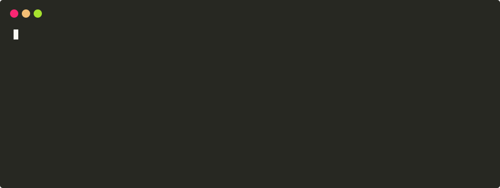

# Codeception Progress Reporter
[](https://github.com/fr05t1k/codeception-progress-reporter/actions/workflows/ci.yml)



## Requirements

| Package version | PHP        | Codeception |
|-----------------|------------|-------------|
| `^5.0`          | `>= 8.1`   | `^5.0`      |
| `^4.0`          | `>= 5.6`   | `>= 2.3`    |

## How to install
```bash
composer require codeception/codeception-progress-reporter
```
## How to enable:
Place it in your `codeception.yml`
```yaml
extensions:
    enabled:
        - Codeception\ProgressReporter\ProgressReporter
```

Or specify manually
```bash
codecept run --ext Codeception\\ProgressReporter\\ProgressReporter
```